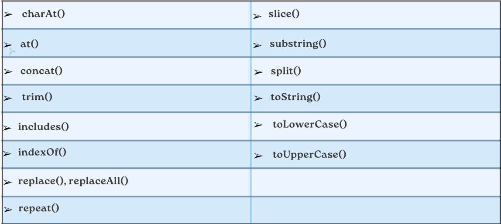

# What is method in Java Script?
## A method is a block of code which only runs when it's called. Methods are used to perform certain actions and are also known as functions.

___

# Creating string in Java Script
![](https://yandex-images.clstorage.net/9gUMm7371/c642f67Fug/o0BMXlUlAMv-9UA9mFXQhK40VIQpk0ZHXRed1cANRggDWRvbYgjCd9hiluUhM29YHE8BRhvwp64yfK1b-6dE8OxDChISZxeUr7ZcaZBW1YazaReVNclCGkdVwdvUBklTVgsi4UF-sBynBrqRDklzDUVJBQkHsbGSVW2oaK6OIIKxdmFyTzxC4dPFAhGgXtOsgEBirzD5QzpFB-X7w2dUJzVUD8taToAighq0jiFycAF9fSwVTJGzrmIDjnKGpBmVlnFafnIZX_7x9RoMs3LWsq5pfYYvyWIIWTra-c5IaygmUSvRekq7G643pq8sYUkNZnQ6KUuQkZxwNZ1FrbsmuIFCSF1hO2_07-sWI698wqKnam-4NtFXOVkYxtrQZU0CIkEw63luuiGeHLymEHdmDW5bFxpamqKXRSOMVaiuPpOkU0F5TzB518DPAS-wSMWOvExXkDHNeg9XA9PAyF5xBhFuL9Vud5suqySHrhJAbQJPSCEWaoWVi0U8qXallQepsFB6aEEsZ8zS0hchqGvtlJ1WfKUz0k46QhDmw-dYVxQLdRb3eXWZJYwToLw3c2kiSkozAmqOpYR9L6V8u4YVo61QT1xLP0XF9NMcI7VR5aOcdUyCGPltMk4G4cfLeHYXPVEu1EJdizCxEae1P39rI29ILzlZgaCAWzS1U7KNF6-WbktxdBBh0-zOIBSVY92AmG92mBjZTT98FNLax1leJy5_MdVFWpgBrRyrkAtAex9mXTEfWZOshVg7vVS6mj2RhHFCaG0TZ-f04gIBql3FqJRocrI373kWTibY4-1kdxwCSg70Z1GoGqAWpYw-VEMPfWcBE0GTiqpiGLZboLAupJpMe3x2NGnJ7ssLLapIxKy1e2KpPtlrEF436PDNdnAeCGk22HJ2ggCeA7qcE2pcIV9vAjpFoo6VQTqqc4GaApGES3R4ZDhK_OPxBSKKbcGPk2xUuRjrdTZWG9DGykw)

## As you can see, you can use single quotes `(’ ')`, double quotes `(" ")`, or backticks `( `` )` to create strings in JavaScript. However, you should be consistent and use the same type of quotes for the same string. Backticks allow you to use template literals, which can interpolate variables and expressions inside the string. You can also use escape characters `(\)` to include special characters inside a string, such as quotes, newlines, or tabs

#### ***Как видите, для создания строк в JavaScript можно использовать одинарные кавычки `(' ')`, двойные кавычки `(" ")` или обратные знаки `( `` )`. Однако следует быть последовательным и использовать один и тот же тип кавычек для одной и той же строки. Обратные кавычки позволяют использовать шаблонные литералы, которые могут интерполировать переменные и выражения внутри строки. Вы также можете использовать экранирующие символы `(\)` для включения в строку специальных символов, таких как кавычки, новая строка или табуляция.***

___

### Example:
```
// Single quotes
let name = 'Alice';

// Double quotes
let greeting = "Hello, " + name + "!";

// Backticks
let message = `Welcome to JavaScript, ${name}!`;
```
___

# Java Script string methods


## Java script string method charAt()

### The `charAt()` method returns the character at a specified index (position) in a string.
### The index of the first character is 0, the second 1,...
### The index of the last character is string lenght - 1.

```
let str = "Hello, world!";
let ch = str.charAt(4); // ch is "o"
```

___

### The length property in JavaScript is used to get the number of elements in an array or the number of characters in a string. 
### For example:
```
let arr = [1, 2, 3, 4, 5];
let len = arr.length; // len is 5

let str = "Hello, world!";
let len = str.length; // len is 13
```
___

### The length property of an array is writable, meaning you can change it by assigning a new value to it. However, this does not necessarily add or remove any elements from the array, but rather truncates or extends it with empty slots. 

#### ***Свойство length массива доступно для записи, то есть вы можете изменить его, присвоив ему новое значение. Однако это не обязательно добавляет или удаляет какие-либо элементы из массива, а скорее усекает или расширяет его за счет пустых слотов. Например***

### For example:
```
let arr = [1, 2, 3, 4, 5];
arr.length = 3; // arr is [1, 2, 3]
arr.length = 6; // arr is [1, 2, 3, empty, empty, empty]
```
___

# Java Script method `at()`
## The `at()` method takes an integer value and returns a new String. This method allows for positive and negative integers. Negative integers count back from the last string character.

```
let arr = [1, 2, 3, 4, 5];
let el = arr.at(-1); // el is 5

let str = "Hello, world!";
let ch = str.at(4); // ch is "o"
```

___

# Java Script method `concat()`
## The `concat()` method joins two or more strings.
## The `concat()` method returns a new string.
## The `concat()` method does not change the orginal string.

```
let str1 = "Hello";
let str2 = "world";
let str3 = str1.concat(" ", str2, "!"); // str3 is "Hello world!"

let arr1 = [1, 2, 3];
let arr2 = [4, 5, 6];
let arr3 = arr1.concat(arr2); // arr3 is [1, 2, 3, 4, 5, 6]
```
___

# Java Script method `replace()`
## The `replace()` method returns a new string with the value (s) replaced.
## The `replace()` method searches a string for a value or a regular expression.
## The `replace()` method does not change the original string

```
let text = "Visit Istanbul";
let result = text.replace("Istanbul", "Dushanbe");
console.log(result);    // Visit Dushanbe
```
___

## The `replaceAll()` method returns a new string with all matches of a pattern replaced by a replacement.

```
let text = "Visit Istanbul. Istanbul is a beautiful city";
let result = text.replaceAll("Istanbul", "Dushanbe");
console.log(result);    // Visit Dushanbe. Dushanbe is a beautiful city
```
___

# Java Script method `split()`
## The `split()` method in JavaScript is used to split a string into an array of substrings based on a separator. The separator can be a string or a regular expression. The method returns a new array and does not change the original string. 

#### ***Метод `split()` в JavaScript используется для разбиения строки на массив подстрок на основе разделителя. Разделитель может быть строкой или регулярным выражением. Метод возвращает новый массив и не изменяет исходную строку. Например***

```
let text = "How are you doing today?";
const myArray = text.split(" ");
myArray is:  // How,are,you,doing,today?
```
___

### Split the words, and return the second word:
```
let text = "How are you doing today?";
const myArray = text.split(" ");
let word = myArray[1];
myArray is:  //  are  // The second word is: are

```
___

### Split the characters, including spaces:
```
const myArray = text.split("");
myArray is:   // H,o,w, ,a,r,e, ,y,o,u, ,d,o,i,n,g, ,t,o,d,a,y,?
```
___

### Use the limit parameter:
```
const myArray = text.split(" ", 3);
myArray is:   //  How,are,you
```

___

# Java Script methos `substring(start,end)` 

## The `substring(start, end)` method in JavaScript is used to get a part of a string between two specified indices. The `start` parameter is the index of the first character to include, and the `end` parameter is the index of the first character to exclude. The method returns a new string and does not change the original string.

#### ***Метод `substring(start, end)` в JavaScript используется для получения части строки между двумя указанными индексами. Параметр `start` - это индекс первого символа, который нужно включить, а параметр `end` - индекс первого символа, который нужно исключить. Метод возвращает новую строку и не изменяет исходную.***

```
let str = "Hello, world!";
let sub = str.substring(1, 5); // sub is "ello"
```
___

### If the `end` parameter is omitted, the method returns the part of the string from the `start` index to the end of the string. For example:

#### ***(Если параметр `end` опущен, метод возвращает часть строки от начального индекса до конца строки. Например:)***

```
let sub = str.substring(7); // sub is "world!"
```

___


### If the `start` parameter is greater than the `end` parameter, the method swaps them before extracting the substring.

#### ***(Если параметр `start` больше параметра `end`, метод меняет их местами перед извлечением подстроки.)***

```
let sub = str.substring(5, 0); // sub is "Hello"

```

___

### If the `start` or `end` parameter is negative or greater than the length of the string, the method treats it as 0 or the length of the string, respectively. 

#### ***(Если параметр `start` или `end` отрицателен или больше длины строки, метод воспринимает его как 0 или длину строки, соответственно.)***

```
let sub = str.substring(-3, 15); // sub is "Hello, world!"

```

___

# Java Script method `slice(start,end)`

## The `slice(start, end)` method in JavaScript is used to get a part of a string or an array between two specified indices. The start parameter is the index of the first element or character to include, and the end parameter is the index of the first element or character to exclude. The method returns a new string or array and does not change the original one

#### ***(Метод `slice(start, end)` в JavaScript используется для получения части строки или массива между двумя указанными индексами. Параметр start - это индекс первого элемента или символа, который нужно включить, а параметр end - индекс первого элемента или символа, который нужно исключить. Метод возвращает новую строку или массив и не изменяет исходную.)***

```
let str = "Hello, world!";
let sub = str.slice(0, 5); // sub is "Hello"

let arr = [1, 2, 3, 4, 5];
let subArr = arr.slice(1, 3); // subArr is [2, 3]

```

___

## The `slice()` and `substring()` methods in JavaScript are both used to get a part of a string between two specified indices. However, they have some differences in how they handle the arguments. Here are some of them:

#### ***(Методы `slice()` и `substring()` в JavaScript используются для получения части строки между двумя указанными индексами. Однако у них есть некоторые различия в том, как они обрабатывают аргументы. Вот некоторые из них:)***

* If the `start` argument is greater than the `end` argument, the `substring()` method will swap them before extracting the substring, while the `slice()` method will return an empty string.
 
  * ___(Если начальный аргумент больше конечного, метод `substring()` поменяет их местами перед извлечением подстроки, а метод `slice()` вернет пустую строку.)___   

* If the `start` or `end` argument is negative, the `substring()` method will treat it as zero, while the `slice()` method will count from the end of the string.

  
  * ___(Если аргумент start или end отрицательный, метод `substring()` примет его за ноль, а метод `slice()` будет считать с конца строки.)___ 


* If the `start` or `end` argument is greater than the length of the string, both methods will use the length of the string as the limit, but the `substring()` method may still swap the arguments if the start argument is larger.


  * ___(Если начальный или конечный аргумент больше длины строки, оба метода будут использовать длину строки в качестве предела, но метод `substring()` может поменять аргументы местами, если начальный аргумент больше.)___ 


___
```
// Example 1: If start > end, substring() swaps them, slice() returns an empty string
let str = "Hello, world!";
let sub1 = str.substring(5, 0); // sub1 is "Hello"
let sub2 = str.slice(5, 0); // sub2 is ""

// Example 2: If start or end is negative, substring() treats it as zero, slice() counts from the end
let sub3 = str.substring(-3, 7); // sub3 is "Hello, "
let sub4 = str.slice(-3, 7); // sub4 is ""

// Example 3: If start or end is greater than the length, both methods use the length as the limit
let sub5 = str.substring(7, 15); // sub5 is "world!"
let sub6 = str.slice(7, 15); // sub6 is "world!"

```

___

# Java Script method `toLowerCase()`

## The `toLowerCase()` method converts a string to lowercase letters. The `toLowerCase()` method does not change the original string.

```
let str = "HELLO, WORLD!";
let lower = str.toLowerCase(); // lower is "hello, world!"

```
___

# Java Script method `toUpperCase()`

## The `toUpperCase()` method converts a string to uppercase letters. The `toUpperCase()` method does not change the original string.

```
let str = "Hello, world!";
let upper = str.toUpperCase(); // upper is "HELLO, WORLD!"

```
___

# Java Script method  `trim()` 

## The `trim()` method removes whitespaces from both sides of sentences. The `trim()` method does not change the original string.

```
let str = "           Hello, world!        ";
let trimmed = str.trim(); // trimmed is "Hello, world!"  // without whitespace

```

___

# Java Script method `includes()`

## The `includes()` method returns true if a string contains a specified string. Otherwise it returns false. The `includes()` method is case sensetive

#### ***(Метод `includes()` возвращает true, если строка содержит указанную строку. В противном случае возвращается false. Метод `includes()` чувствителен к регистру)***

```
let str = "Hello, world!";
let result = str.includes("world"); // result is true

let arr = [1, 2, 3, 4, 5];
let result = arr.includes(3); // result is true

```

___

# Java Script method `toString()`

## The `toString()` method retrurns a string representing the object. By default `toString()` takes no parameters

#### ***(Метод `toString()` возвращает строку, представляющую объект. По умолчанию `toString()` не принимает никаких параметров)***

```
let number = 99;
console.log(typeof number.toString());  // 'string'
console.log(typeof number);  // 'number'
```

___


# Java Script method `indexOf()` 

## The `indexOf()` method returns the position of the first occurence of a value in a string 
## The `indexOf()` method returns -1 if the value is not found.
## The `indexOf()` method is case sensitive

#### ***(Метод `indexOf()` возвращает позицию первого вхождения значения в строку.  Метод `indexOf()` возвращает -1, если значение не найдено. Метод `indexOf()` чувствителен к регистру.)***

```
let text = "Hello world, welcome to the universe.";
let result = text.indexOf("welcome");    // 13
```

___

# Java Script method `repeat()`
## The `repeat()` method creates a new string by repeating the given string a specified number of times and returns it.

#### ***(Метод `repeat()` создает новую строку, повторяя заданную строку указанное количество раз, и возвращает ее.)***

```
let text = "Hello world!";
let result = text.repeat(4); //   Hello world!Hello world!Hello world!Hello world!
```

___

# Java Script methods number

 ## The `Math.floor()` method rounds a number down to the nearest integer. It always returns the largest integer that is less than or equal to the given number.

 #### ***(Метод `Math.floor()` округляет число до ближайшего целого. Он всегда возвращает наибольшее целое число, которое меньше или равно заданному.)***

 ```
let number = 38.8;
let roundedNumber = Math.floor(number);
console.log(roundedNumber); // Output: 38

 ```

 ___

 ## The `Math.round()` method rounds a number to the nearest integer.

#### ***(Метод `Math.round()` округляет число до ближайшего целого.)***

```
Math.round(20.49) returns 20.
Math.round(20.5) returns 21.
Math.round(42) returns 42.
Math.round(-20.5) returns -20.
Math.round(-20.51) returns -21.
```

___

## The `Math.ceil()` method rounds a number up to the nearest integer. It always returns the smallest integer that is greater than or equal to the given number.

#### ***(Метод `Math.ceil()` округляет число до ближайшего целого. Он всегда возвращает наименьшее целое число, которое больше или равно заданному числу.)***

```
let number = 38.1;
let roundedNumber = Math.ceil(number);
console.log(roundedNumber); // Output: 39

```

___

### `Math.ceil()` always rounds up.
### `Math.round()` rounds to the nearest integer (up or down).

#### ***(`Math.ceil()` всегда округляет в большую сторону. `Math.round()` округляет до ближайшего целого числа (вверх или вниз).)***

___

## The `Math.max()` method is used to find the largest value among a set of numbers.

#### ***(Метод `Math.max()` используется для поиска наибольшего значения среди набора чисел.)***

```
const numbers = [1, 2, 3, 10, 5];
const maxNumber = Math.max(...numbers); // Spread operator to pass array elements
console.log(maxNumber); // Output: 10
```
### If any argument is not a valid number, it returns NaN (Not-a-Number).
___

##  The `Math.min()` method is used to find the smallest value among a set of numbers. 

#### ***(Метод `Math.min()` помогает найти наименьшее значение среди набора чисел.)***

```
const foo = 15;
const boundary = 10;
const clippedValue = Math.min(foo, boundary);
console.log(clippedValue); // Output: 10

```

___

## The `Math.pow()` method is used to calculate the value of a base raised to the power of an exponent. 

#### ***(Метод `Math.pow()` используется для вычисления значения основания, возведенного в степень экспоненты.)***

```
let x = Math.pow(4, 3);  // 64
```

___

## The `Math.sqrt()` method is used to calculate the square root of a given number.

#### ***(Метод `Math.sqrt()` используется для вычисления квадратного корня из заданного числа.)***

```
let x = Math.sqrt(9);  // 3
```
If `x` is negative, it returns `NaN` (Not-a-Number).
___

## `Math.abs()` method in JavaScript is quite useful! It returns the absolute value of a given number

#### ***(Метод `Math.abs()` в JavaScript весьма полезен! Он возвращает абсолютное значение заданного числа)***

```
let x = Math.abs(-7.25);  // 7.25
```
`Math.abs`("Hello") returns `NaN` (since it’s not a valid number).
___

## The `Math.random()` method in JavaScript is a powerful tool for generating random numbers.

#### ***(Метод Math.random() в JavaScript - это мощный инструмент для генерации случайных чисел.)***

####  Return a random number between 0 and 10:
```
let x = Math.random() * 10;
```
___

```
console.log(Math.floor(Math.random(1)*10));
```
___

## The `isNaN()` method is used to determine whether a value is NaN (which stands for “Not-a-Number”).

#### ***(Метод `isNaN()` используется для определения того, является ли значение NaN (что расшифровывается как "Not-a-Number").)***

* __Parameters:__
  * `value`: The value to be tested. 

* __Return Value:__
  * A boolean:
    * `true` if the value is NaN.  
    * `false` if the value is a valid number.


### `isNaN(123)` returns false because 123 is a valid number.
### `isNaN(-1.23)` returns false because -1.23 is a valid number.
### `isNaN('Hello')` returns true because 'Hello' is not a valid number.
### `isNaN('2005/12/12')` returns true because '2005/12/12' is not a valid number.
### `isNaN(NaN)` returns true because NaN itself represents “Not-a-Number.”
